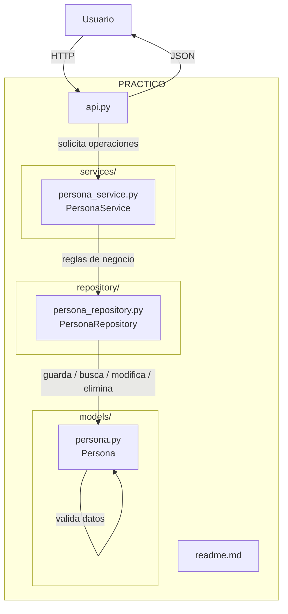

```mermaid
flowchart TD
    Usuario["Usuario"]

    subgraph Proyecto["PRACTICO"]
        API["api.py"]

        subgraph Services["services/"]
            Service["persona_service.py<br/>PersonaService"]
        end

        subgraph Repository["repository/"]
            Repo["persona_repository.py<br/>PersonaRepository"]
        end

        subgraph Models["models/"]
            Model["persona.py<br/>Persona"]
        end

        README["readme.md"]
    end

    Usuario -->|"HTTP"| API
    API -->|"solicita operaciones"| Service
    Service -->|"reglas de negocio"| Repo
    Repo -->|"guarda / busca / modifica / elimina"| Model
    Model -->|"valida datos"| Model

    API -->|"JSON"| Usuario
```

